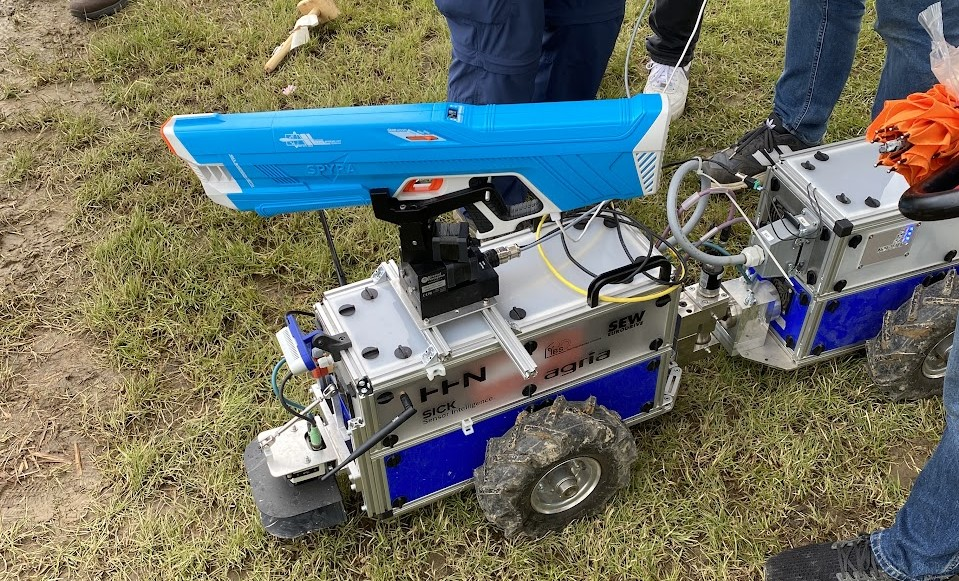
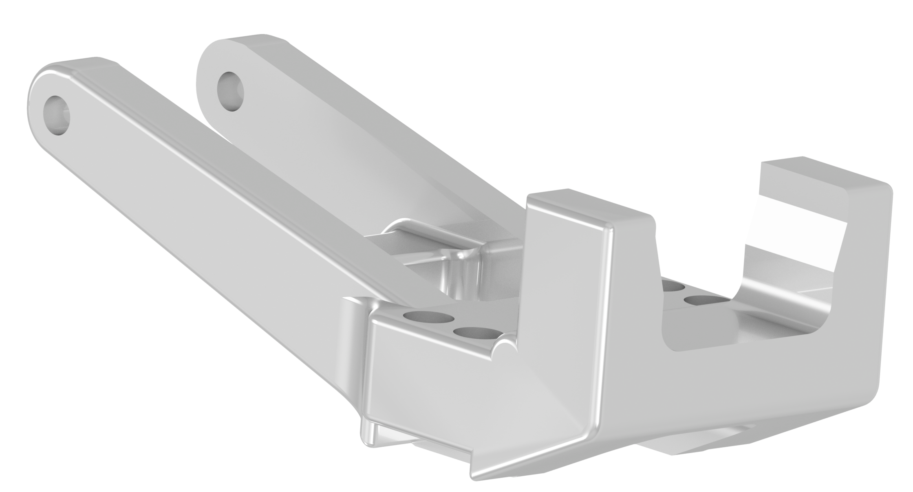

# PTU Control ROS Package

<p align="center">
    <a href="images/fre_aufbau.JPG">
        
    </a>
    <a href="images/Spritzenhalter_720.png">
        
    </a>
</p>


## Overview

This repository contains a ROS package for controlling a Pan-Tilt Unit (PTU) and various components using ROS nodes. It enables the use of Cartesian coordinates and was designed for participation in FRE 2024. The repository also includes CAD files used for mounting on a Directed Perception/FLIR D47 PTU.

### Prerequisites

Before using this package, make sure you have the following installed:

- **ROS (Noetic)**
- **PTU hardware with serial connection**
- ROS <a href="https://wiki.ros.org/asr_flir_ptu_driver">ASR driver</a>
- **Python 3.x**

### Installation

1. Install the required libraries for the ASR driver.

    Install the WxWidget library (version 3.0):
    ```bash
    sudo apt install libwxgtk3.0-gtk3-dev
    ```

    Install the Boost library:
    ```bash
    sudo apt-get install libboost-all-dev
    ```

2. Clone the repository into your ROS workspace:
    ```bash
    cd ~/catkin_ws/src
    git clone https://github.com/asr-ros/asr_flir_ptu_driver.git
    ```

3. Build the package:
    ```bash
    cd ~/catkin_ws
    catkin_make
    source devel/setup.bash
    ```

4. Grant the current user access to serial connections by adding them to the `dialout` group:
    ```bash
    sudo adduser $USER dialout
    ```

5. Verify that the serial connection is recognized:
    ```bash
    dmesg | grep tty
    ```

### Usage

Before starting, ensure the PTU is securely mounted, connected via the RS-232 interface, and powered (12 to 30 V).

#### Steps to Launch the Software:

1. Start the ROS core:
    ```bash
    roscore
    ```

2. Launch the ASR driver:
    ```bash
    roslaunch asr_flir_ptu_driver ptu_left.launch
    ```

3. Run the following commands to initialize additional nodes after the PTU calibration is complete:
    ```bash
    rosrun ros_ptu_controller controller.py
    rosrun ros_ptu_controller trigger_listener.py
    rosrun ros_ptu_controller xyz_talker.py
    ```

---

## License

Free use.
